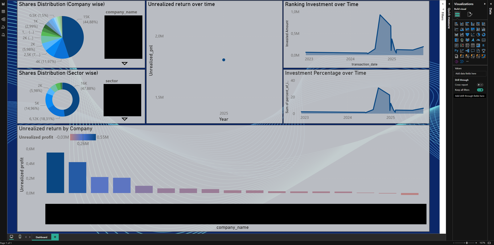
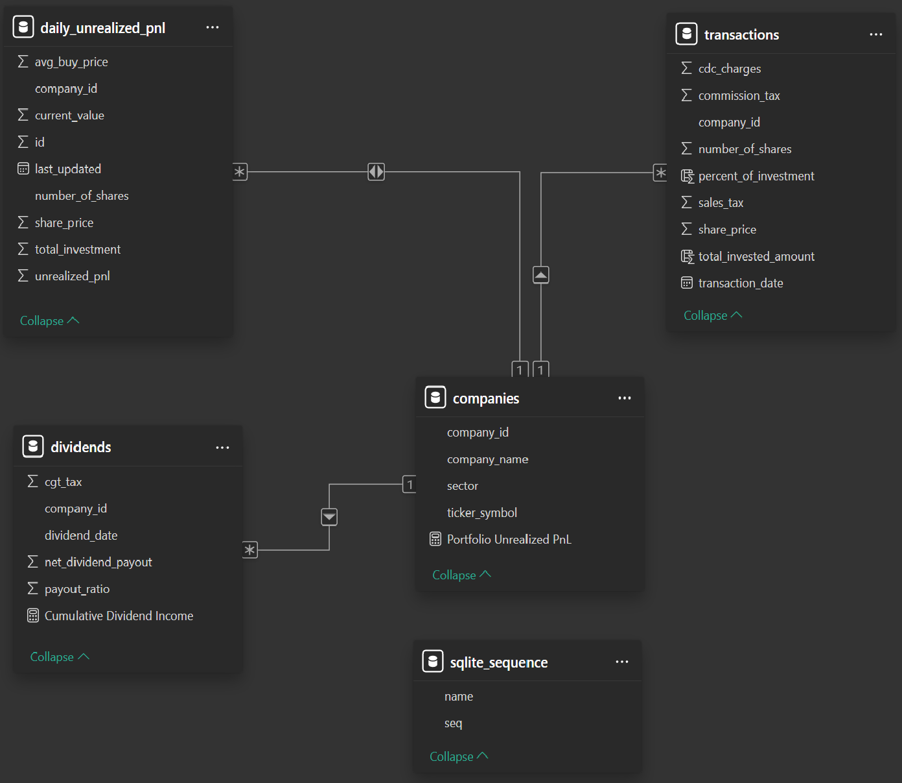

# WELCOME TO PORTFOLIO DATABASE MANAGEMENT AND DASHBOARD PROJECT

# OBJECTIVE 
The goal of this project is to create a simple database using SQLite3
to store information regarding the PSX stocks in my portfolio. I have got the idea 
for the project from Google sheets where I used to store this information and perform
different analysis on it, but sheets has its limitations with scalability and customization,
a relational database allows me to scale as I want and also perform various calculations on the
go. The second goal is to create a dashboard, so I can visualize in real-time the progress of my 
portfolio for which I have used PowerBI desktop version. While this visualization can be achieved
via apps like "investify" but they have tons of ads, and they tend to be buggy plus you only see what 
the app designer wants you to see by creating my own dashboard I have the power to control it and 
customize it.

# ETL PIPELINE
The project runs an ETL pipeline and use webscraping to get latest PSX data for 
closing price of shares. First I have created csv files namely; companies, transactions and dividends, data is then 
read from these csv files and then transformed for some basic formating. 
For webscraping I have employed "Playwright" package as it allows me to use 
"asyncio" library which is a powerful tool to asynchronously connects to different webpages and extract 
data, this allows for faster data extraction and better exception handling. The data is then transformed,
i.e, any unnecessary strings are removed and formatting is performed for further loading into tables as
well as calculations. Finally, data is loaded into respective tables that were created beforehand using 
SQL query executions. Schemas for tables should be followed while creating your own CSVs and I will share the 
schemas below. Another key point is that using logs function, each step of the ETL and calculations is logged
to a separate "logs.txt file"

# CALCULATIONS 
In order to make sure that historic data and current data for real-time stock prices is
correctly utilized for daily unrealized profit and loss calculation, I have performed this calculation 
inside calculation script by reading the respective tables, grouping the transactions as per 
company ids and aggregating average buy price for a single stock, joining the table with real-time 
prices table on company_id using left join and finally aggregating the total invested amount for all 
stocks and finding unrealized profit and loss at the given date. This information can now be used to 
create a table that is then used as a live dashboard to visualize portfolio return over time similarly
to how one can see in brokerage apps like scalable and trade republic although with less granularity

## PROJECT STRUCTURE
```
StockPortfolio-DB/
├── app/
│   ├── extract.py          # Data extraction from CSV and web scraping
│   ├── transform.py        # Data cleaning and transformation
│   ├── load.py            # Loading data to SQLite database
│   ├── calculations.py    # Unrealized P&L calculations
│   ├── main.py           # Main ETL orchestration
│   └── logs.py           # Logging utilities
├── data/                  # CSV files and database (not in repo)
│   ├── companies.csv
│   ├── transactions.csv
│   ├── dividends.csv
│   ├── logs.txt            # Will be generated after the first successful docker compose
│   └── stock_portfolio.db  # Will be generated after the first successful docker compose
├── Dockerfile
├── docker-compose.yaml
└── requirements.txt
```

## Features
- Extracts data from CSV files and scrapes real-time stock prices
- Transforms and cleans financial data
- Loads data into SQLite database
- Calculates daily unrealized profit/loss
- Dockerized for easy deployment

## Prerequisites
- Docker and Docker Compose
- Python 3.12+ (if running locally)

## Setup Instructions

### 1. Clone the Repository
```bash
git clone https://github.com/yourusername/StockPortfolio-DB.git
cd StockPortfolio-DB
```

### 2. Prepare Data Files
Create a `data/` folder and add your CSV files (just enter data as per column names without entering column names):
- `companies.csv` - Company information using columns ---> (company_name, sector, ticker_symbol)
- `transactions.csv` - Transaction history using columns ---> (company_id, transaction_date, number_of_shares, share_price, sales_tax, commission_tax, cdc_charges)
- `dividends.csv` - Dividend information using columns ---> (company_id, dividend_date, payout_ratio, cgt_tax, net_dividend_payout)

#### Important things to consider here: 
- That company_id has to be entered correctly for transactions and dividends, this can be achieved by keeping the tab of companies.
that you hold in companies table, their index is their id so first company in the table will have id = 1 and third company will have the id = 3 and so on.
- Please use the same column structure as mentioned when creating CSVs, if you have an Excel file then convert it to CSV before putting it into the directory.
- The values for all the columns with Tax, charges and commissions can be NULL or ZERO.
- Still confused? see sample data folder for more.

### 3. Run with Docker

No need to install requirements.txt separately you can run it directly from docker compose as follows:
```bash
docker-compose up
```

The pipeline will:
1. Install the required packages
2. Extract data from CSVs
2. Scrape real-time prices from PSX website
3. Transform and clean the data
4. Load into SQLite database
5. Calculate unrealized P&L

### 4. Access the Database
The database will be created at `data/stock_portfolio.db`

## Database Schema
- **companies** - Company master data
- **transactions** - Buy/sell transactions
- **dividends** - Dividend payouts
- **realtime_prices** - Current market prices
- **daily_unrealized_pnl** - Daily P&L calculations

## Technologies Used
- Python 3.12
- Pandas - Data manipulation
- SQLite - Database
- Playwright - Web scraping
- Docker - Containerization

## Dashboard Design
- Since the database is hosted locally as a SQLite3 db, connecting it to PowerBI or Tableau will require and ODBC driver.
- You can use this Youtube video to learn how to connect your database to PowerBI: [How to connect db file to PowerBI](https://www.youtube.com/watch?v=v9OG5Ry5zDU)
- Once connected you can get all the tables in powerBI and start creating visuals as per your desire

## Images for Dashboard




## License
MIT License
